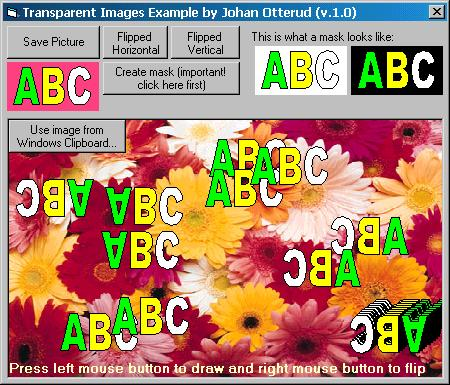

## Using Transparent Images Example\!

### Description

This example demonstrates what most people using Graphics in VB really needs, the use of Transparent Images in your programs that can overlap each other (using BitBlt), like GIF images do for example! This is the Ultimate Demonstration Program and it's REALLY easy to use. All the lines have been commented and turned into functions so you can easily use them in your programs. The program also shows how you can flip your images horizontal and vertical with just a mouse-click and includes a really fast code for creating masks (which you need when dealing with Transparent Images). This is a "must have" code not only for the beginners but also for EVERYONE using Visual Basic!
 
### More Info
 
Make sure Scale Mode 3 - Pixels is used in every PictureBox when you use the code in your own program!

             |
---                |---
**Submitted On**   |2000-02-25 14:49:42
**By**             |[Johan Otterud](https://github.com/Planet-Source-Code/PSCIndex/blob/master/ByAuthor/johan-otterud.md)
**Level**          |Intermediate
**User Rating**    |5.0 (30 globes from 6 users)
**Compatibility**  |VB 5\.0, VB 6\.0
**Category**       |[Custom Controls/ Forms/  Menus](https://github.com/Planet-Source-Code/PSCIndex/blob/master/ByCategory/custom-controls-forms-menus__1-4.md)
**World**          |[Visual Basic](https://github.com/Planet-Source-Code/PSCIndex/blob/master/ByWorld/visual-basic.md)
**Archive File**   |[CODE\_UPLOAD36002252000\.zip](https://github.com/Planet-Source-Code/johan-otterud-using-transparent-images-example__1-6253/archive/master.zip)

